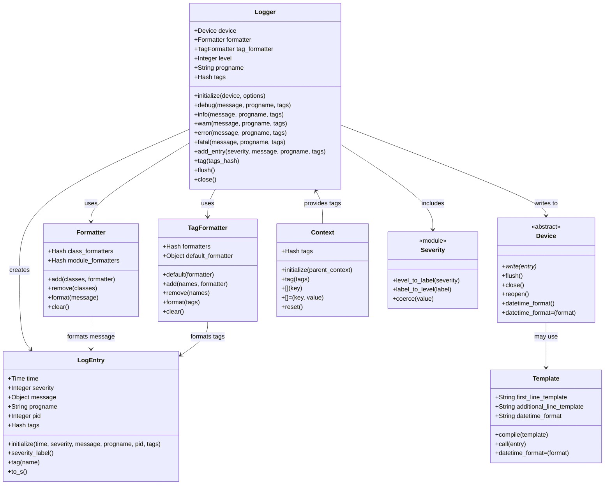
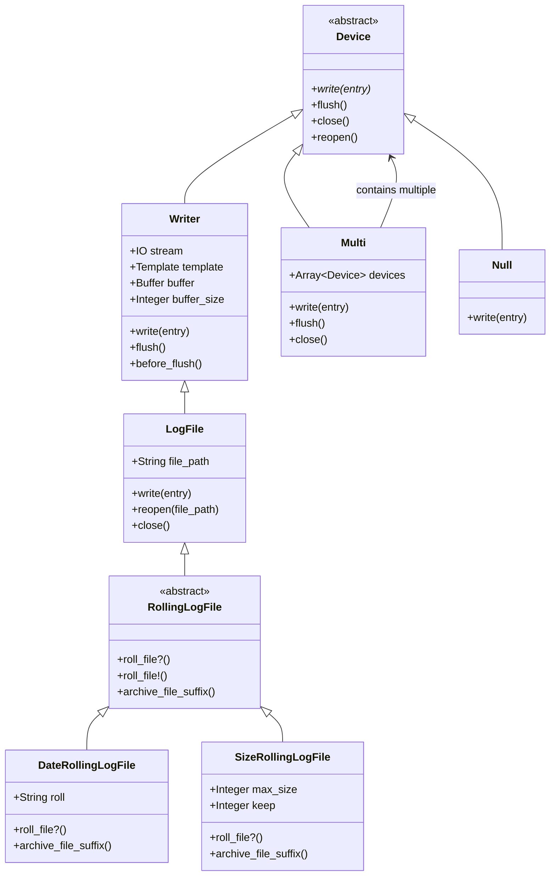
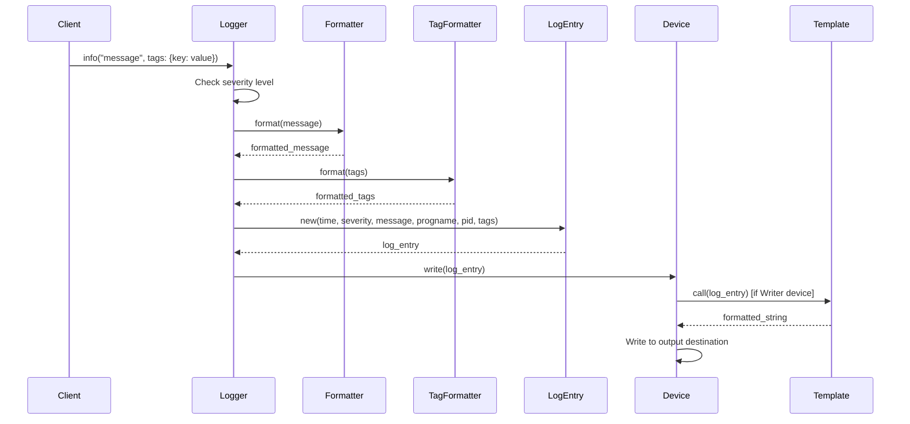

# Lumberjack Gem Architecture

Lumberjack is a simple, powerful, and fast logging implementation in Ruby. It uses nearly the same API as the Logger class in the Ruby standard library and as ActiveSupport::BufferedLogger in Rails. The gem is designed with structured logging in mind, but can be used for simple text logging as well.

## Overview

The Lumberjack architecture follows a clean separation of concerns with the following main components:

- **Logger**: The main interface for creating log entries
- **LogEntry**: Data structure that captures log messages and metadata
- **Device**: Abstraction for different output destinations
- **Formatter**: Handles message formatting and transformation
- **TagFormatter**: Specialized formatting for tags
- **Template**: Template engine for customizing log output format
- **Context**: Thread-local context for managing tags across log entries
- **Severity**: Log level management and filtering

## Core Architecture

## Device Hierarchy

The Device system provides a pluggable architecture for different output destinations:

## Data Flow

The logging process follows this flow:

## Key Features

### Thread Safety
- Logger operations are thread-safe
- Context provides thread-local tag storage
- Devices handle concurrent writes appropriately

### Structured Logging
- LogEntry captures structured data beyond just the message
- Tags provide key-value metadata
- Formatters can handle complex object serialization

### Pluggable Architecture
- Device abstraction allows custom output destinations
- Formatter system enables custom message transformation
- TagFormatter provides specialized tag handling

### Performance Optimization
- Buffered writing in Writer devices
- Lazy evaluation of expensive operations
- Configurable flush intervals

### ActiveSupport Compatibility
- TaggedLoggerSupport module provides Rails compatibility
- Compatible API with standard library Logger
- Supports ActiveSupport::TaggedLogging interface
